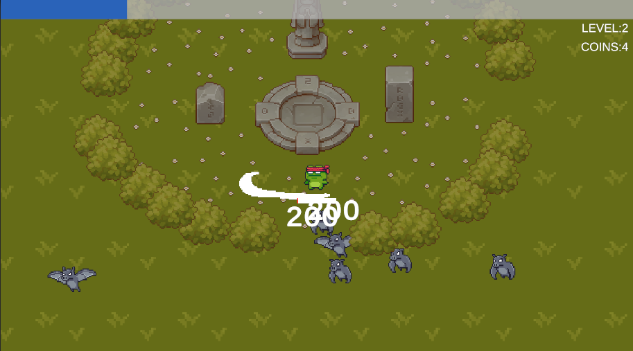
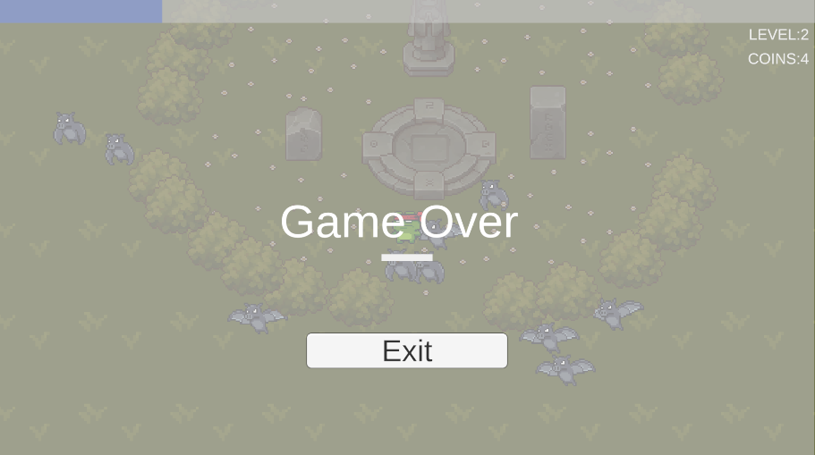
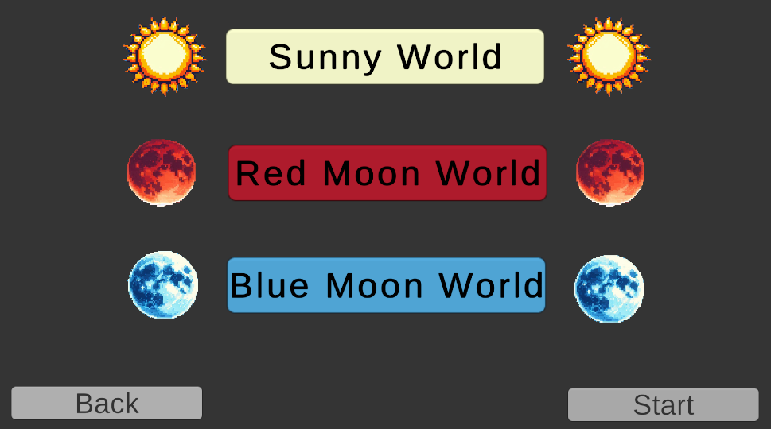
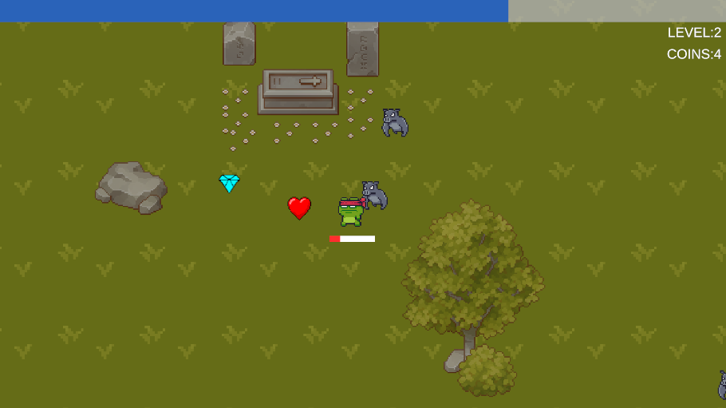

# MoonlightSurvivors

## Table of Contents
- [Overview](#overview)
- [How to Play](#how-to-play)
- [Features](#features)
  - [Version 1.0](#version-10)
  - [Version 1.2](#version-12)
- [Credits](#credits)

## Overview
This is a 2D Vampire Survivors Like Game. The game has the basic mechanics of the vampire survivors game. I made this game to improve myself in Unity.

  
  

  
  

## How to Play
[Play the game on Unity Play](https://play.unity.com/en/games/b6ba703a-7afd-4f93-a751-d51ed4e44cca/moonlight-survivors-demo)

[Play the game on itch.io](https://curlygamely.itch.io/moonlight-survivors)

- Movement: Use the arrow keys or WASD.
- Destroy chests for a chance to gain health, dimond or coin.
- Collect diamonds dropped by enemies to gain extra experience. You will also gain experience when you kill an enemy. 
- Choose a new weapon when you level up or update your weapon damage, attack speed or attack count. You can take shield too.
- Survive for up to 5 minutes and win.
- Buy upgrades from the store with the money collected.
- You can pause the game when you press the Esc key.

## Features

### Version 1.0
- **Player Mechanics**:
  - Horizontal and vertical movement on map.
 
- **Sounds**:
  - **Game Sounds**: Background music.

- **Game Systems**:
  - **Health System**: Player have health bar that decrease when taking damage and increase when collect hearth.
  - **Level Up System**: System for collect exp points and reach higher levels.
  - **Item System**: The player can collect coins and dropped dimonds from enemies and hearts from chests.
  - **Spawn Systems**: There are spawn systems for enemies and chests.
  - **World Loop System**: The map is regenerated for infinite world scrolling.
  - **Weapon System**: System for manage weapon data and upgrades.

- **Enemies**:
  - **Bats**: Instantly deals damage to the player on contact.

- **UI**:
  - **Main Menu**: The starting screen where players can begin the game or exit. 
  - **Game Over Panel**: Displayed when the player runs out of health. It contain exit button which returns to main menu.
  - **Pause Panel**: Displayed when the player press the Esc key. It contain main menu and close buttons.
  - **Level Up Panel**: Displayed when the player collect enough exp points for level up and show weapon upgrades.
 
### Version 1.2

- **Game Systems**:
  - **Health System**: Added boss health bar.
  - **Item System**: Chests are dropped diamond, coin, health and enemies dropped diamond, coin.
  - **Spawn Systems**: Spawn system improved. Enemy and object spawn wave system added.
  - **World Loop System**: Map loop fixed and improved.
  - **Weapon System**: New weapons and upgrades added.
  - **Enemy System**: System for enemy stats manager which hp,damage,speed etc.
  - **Passive Items System**: Added armor upgrade. Hp and damage persist upgardes added ( on store )

- **Enemies**:
  - **Slime and radish**: Sunny world enemies. Instantly deals damage to the player on contact. Big Slime is boss.
  - **Bats and Wild pigs**: Red world enemies. Instantly deals damage to the player on contact. Big bat is boss.
  - **Ghosts and Skuls**: Blue world enemies. Instantly deals damage to the player on contact. Big Ghost is boss.

- **Weapons**:
  - **Whip**: Upgrades: faster attack, double strike, more damage.
  - **Throwing Ball**: Upgrades: faster attack, double ball throw, more damage.
  - **Area Damage**: Upgrades: more damage.

- **UI**:
  - **Main Menu**: Added store button.
  - **Level Up Panel**: Menu improved. Added Item description panel.
  - **Win Panel**: Displayed when player can survive 5 min on game.
  - **Store Panel**: It contains persistent upgrades for health and damage which purchase with coins.
  - **Character Selection Panel**: 2 character selectable.
  - **World Selection Panel**: 3 world selectable.

## Credits

This project uses various assets from the Unity Asset Store. Below are the credits and links to the assets used:

Sprites:
- [2D Pixel art pack for top down map](https://assetstore.unity.com/packages/2d/environments/pixel-art-top-down-basic-187605)
- [2D Pixel art pack](https://assetstore.unity.com/packages/2d/characters/pixel-adventure-1-155360)
- [2D Pixel art pack](https://assetstore.unity.com/packages/2d/characters/pixel-adventure-2-155418)
  
Sound Effects:
- [Sound Effects Pack for background music](https://assetstore.unity.com/packages/audio/music/complete-mysterious-forest-game-music-pack-234050)

