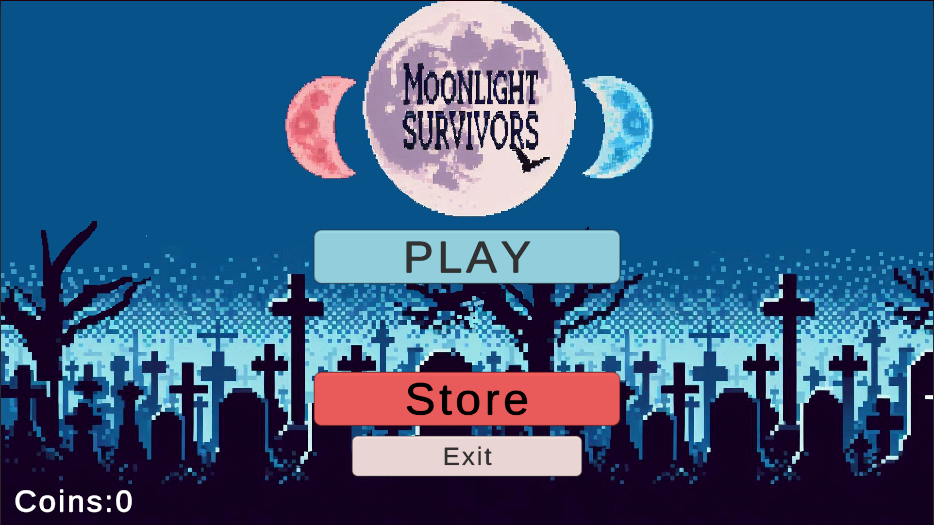
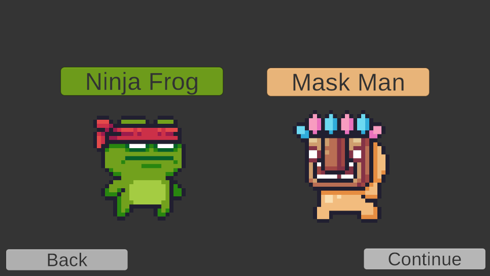
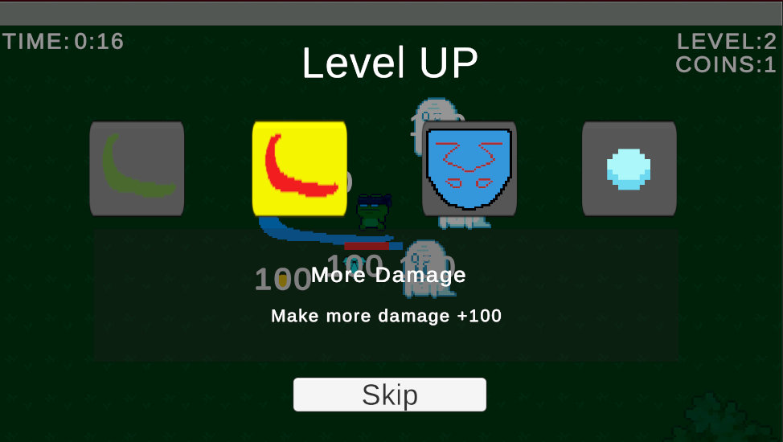

# MoonlightSurvivors

## Table of Contents
- [Overview](#overview)
- [How to Play](#how-to-play)
- [Features](#features)
  - [Version 1.0](#version-10)
- [Credits](#credits)

## Overview
This is a 2D Vampire Survivors Like Game. The game is under development and I am sharing the demo version. I will update the game.

  
  

  
  

## How to Play
[Play the game on Unity Play](https://play.unity.com/en/games/b6ba703a-7afd-4f93-a751-d51ed4e44cca/moonlight-survivors-demo)

- Movement: Use the arrow keys or WASD.
- Destroy chests for a chance to gain health. 
- Collect diamonds dropped by enemies to gain extra experience. You will also gain experience when you kill an enemy. 
- Choose a new weapon or update your weapon damage or attack speed when you level up.
- You can pause the game when you press the Esc key.

## Features

### Version 1.0
- **Player Mechanics**:
  - Horizontal and vertical movement on map.
 
- **Sounds**:
  - **Game Sounds**: Background music.

- **Game Systems**:
  - **Health System**: Player have health bar that decrease when taking damage and increase when collect hearth.
  - **Level Up System**: System for collect exp points and reach higher levels.
  - **Item System**: The player can collect coins and droped dimonds from enemies and hearts from chests.
  - **Spawn Systems**: There are spawn systems for enemies and chests.
  - **World Loop System**: The map is regenerated for infinite world scrolling.
  - **Weapon System**: System for manage weapon data and upgrades.

- **Enemies**:
  - **Bats**: Instant damage upon contact.

- **UI**:
  - **Main Menu**: The starting screen where players can begin the game or exit. 
  - **Game Over Menu**: Displayed when the player runs out of health. It contain exit button which returns to main menu.
  - **Pause Menu**: Displayed when the player press the Esc key.
  - **Level Up Menu**: Displayed when the player collect enough exp points for level up and show weapon upgrades.

## Credits

This project uses various assets from the Unity Asset Store. Below are the credits and links to the assets used:

Sprites:
- [2D Pixel art pack for top down map](https://assetstore.unity.com/packages/2d/environments/pixel-art-top-down-basic-187605)
- [2D Pixel art pack](https://assetstore.unity.com/packages/2d/characters/pixel-adventure-1-155360)
- [2D Pixel art pack](https://assetstore.unity.com/packages/2d/characters/pixel-adventure-2-155418)
  
Sound Effects:
- [Sound Effects Pack for background music](https://assetstore.unity.com/packages/audio/music/8bit-music-062022-225623)

